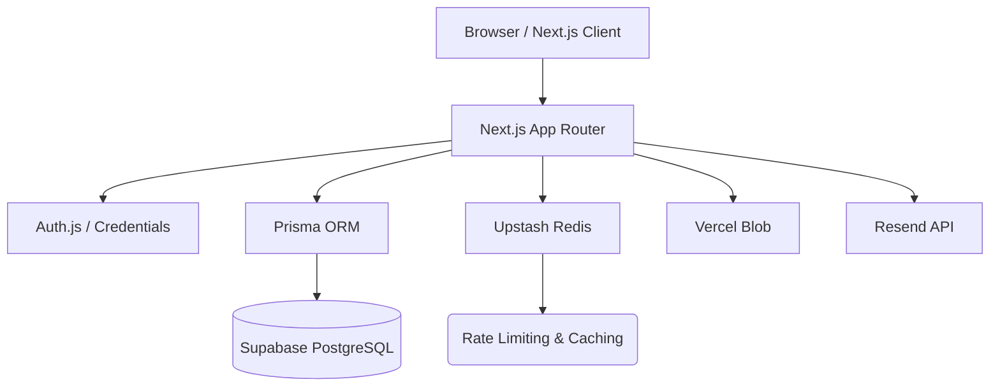

# CodeQuest Architecture

CodeQuest is built using a modern, serverless, and edge-ready architecture optimized for high performance and **Zero-Cost** operation (Free Tiers).

## High-Level Diagram

## Core Infrastructure

### 1. Framework & Runtime (Next.js)
- **App Router (`src/app`)**: The foundation of the application. Uses a hybrid approach of React Server Components (RSC) by default for performance and SEO, and Client Components (`'use client'`) strictly for interactivity (hooks, state).
- **Server Actions (`src/actions`)**: All mutations (login, signup, quest actions, data updates) are executed securely via Next.js Server Actions. This eliminates the need for separate API routes for internal operations.

### 2. Database Layer (Supabase + Prisma)
- **Supabase (PostgreSQL)**: Serves as the primary relational database.
- **Connection Pooler**: To circumvent Supabase's IPv4 deprecation on the direct port (`5432`), the application must connect via the IPv4 connection pooler (port `6543`).
- **Prisma ORM**: Acts as the strongly-typed database client. Schema definitions are centralized in `prisma/schema.prisma`.

### 3. Authentication Layer (Auth.js)
- **Credentials Provider**: Custom authentication flow implemented via NextAuth v5 (Auth.js). 
- **Security Check**: Enforces email verification (`emailVerified != null`) before allowing a login session.
- **Session Strategy**: Uses JWT strategies due to the serverless nature of Vercel.

### 4. Zero-Cost External Services
- **Upstash Redis**: Handles rate limiting (e.g., preventing brute force attacks on the login and signup routes).
- **Vercel Blob**: Serverless file storage for user avatars and quest submission attachments.
- **Resend**: Transactional email provider for verification and notifications. (Requires custom DNS setup for the verified subdomain to operate beyond testing).

## Scaling Considerations for UKM
Given the target audience (UKM Members, potentially hundreds of concurrent users during Open Recruitment):
1. **Database Exhaustion**: The Prisma connection pool MUST use Supabase's transaction pooler (`6543`) to prevent serverless functions from opening too many concurrent direct connections.
2. **Edge Caching**: Static assets and public quest boards should leverage Next.js caching to minimize database hits.
